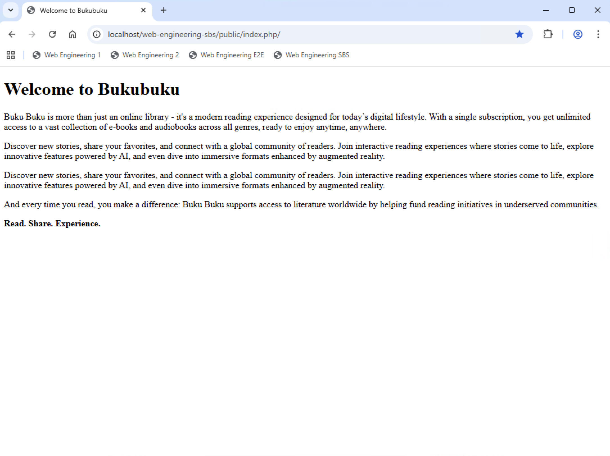
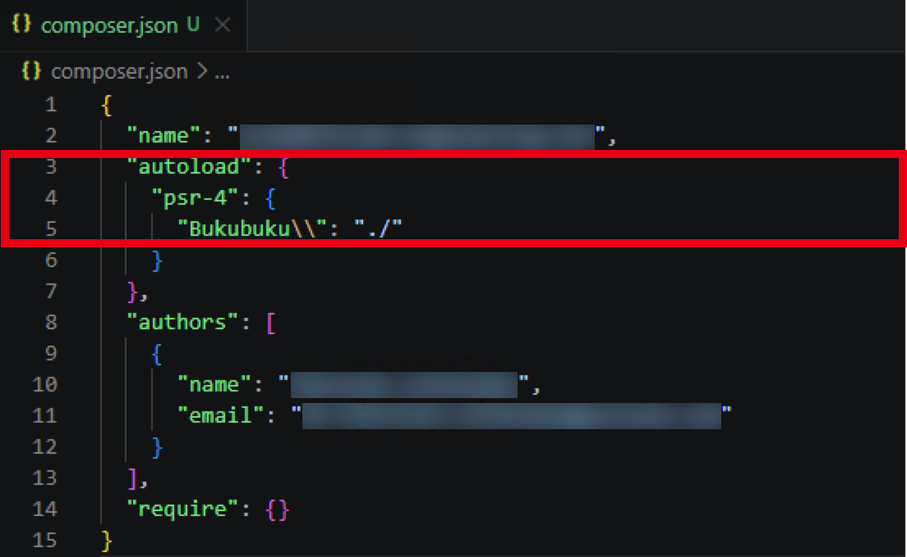

# Chapter 01: Create the basic application structure

In this chapter you will create the basic application structure. This includes some of the core classes as well as views.

## Clone and inspect repository (5 min)

- Clone the repository: `git clone https://github.com/ts160876/web-engineering-sbs.git`
- Checkout the commit: `git checkout 38780d8538cc72ac0f7ef1b51b4874ca91151257`
- Preview the `index.php` file in folder `/public` via your web browser. It should look as follows:
  

## Create database artifacts (10 min)

- If your MySQL database already has the `bukubuku`schema, then delete it.
- Create and fill all required database tables by using the SQL statements provided in folder `/utilities`. Use the MySQL command line tool (which we discussed in chapter 5) for this. In the command line tool you can use the `SOURCE` command to execute all SQL statements in a file. Example: `SOURCE /MAMP/htdocs/web-engineering-sbs/utilities/data-manipulation.sql`.
- Create a list each of all books, checkouts and users by means of SQL (not via PHP).

## Create the folders required and initialize Composer (5 min)

Create the following folders:

- `/controllers`
- `/core`
- `/core/exception`
- `/models`
- `/views`

Whenever you create classes ensure that they are stored in the correct folder and are assigned to the correct namespace. The general logic is:

- `/` => `namespace Bukubuku`
- `/controllers` => `namespace Bukubuku\Controllers`
- `/core` => `namespace Bukubuku\Core`
- `/core/exception` => `namespace Bukubuku\Core\Exception`
- ...

Example: The class `Bukubuku\Core\Application` must be stored in file `Application.php` in folder `/core`.

Run `composer init` in the main directory of the application, e.g. `/MAMP/htdocs/web-engineering-sbs`. Ensure that `composer.json` looks like this:


Afterwards run `composer dump-autoload`.

## Create the first important classes (15 min)

Create the following classes, properties and (empty) methods:

- `Class Bukubuku\Core\Application`
  - `Static public Application $app`
  - `Public Request $request`
  - `Public Reponse $response`
  - `Public Router $router`
  - `Public string $rootDirectory`
  - `Public function __construct(string $rootDirectory)`
  - `Public function run()`

- `Class Bukubuku\Core\Request`
  - `Public function getPath(): string`
  - `Public function getRequestMethod(): string`
  - `Public function getRequestUri(): string`
  - `Public function getScriptName(): string`

- `Class Bukubuku\Core\Response`

- `Class Bukubuku\Core\Router`
  - `Private array $routes`
  - `Public function registerGet(string $path, callable|array|string $action)`
  - `Public function registerPost(string $path, callable|array|string $action)`
  - `Public function resolve(): string`

- `Class Bukubuku\Core\View`
  - `Public function render(string $view, array $parameters = []): string`

Implement the constructor of the `Application` class and ensure that all properties are set in the contructor **including** the static property (which should store the newly created instance of the `Application` class).

## Create the first views (10 min)

Create the following views in the `/views`folder:

- `contact.php` => Contact
- `error.php` => Error
- `home.php` => Home
- `/users/create.php` => Create User
- `/users/edit.php` => Edit User
- `/users/list.php` => List Users

For now, all views just include a `H1` heading **except** `home.php`. For the `home.php`view copy the complete `HTML`code from `index.php` to `home.php`. Do **not** copy the `PHP`code.

Preview all views via your web browser and ensure they are correctly displayed.

## Implement the basic logic to route the incoming requests (30 min)

Now the fun begins. Remove the `HTML` code from `index.php` and implement the following logic.

- Ensure that autoloading works by adding the following lines to `index.php`.

```
//Ensure that autoloading works.
require_once __DIR__ . '/../vendor/autoload.php';
```

- Create an instance of the `Application` class. The `$rootDirectory` corresponds to `dirname(__DIR__)` (the value can, for example, be `C:\MAMP\htdocs\web-engineering-sbs`)
- Implement the `registerGet` and `registerPost` methods in a way that the `Router`class can store the path and the action to be performed when the path is accessed. The `Router` class stores the information in a nested array `$routes`. The following tables shows the structure of the nested array:
  | Method | Path | Action |
  | ------------- | ------------- | ----------- |
  | `GET` | `/contact` | ... |
  | `GET` | `/users/create` | ... |
  | `POST` | `/users/create` | ... |
  | ... | ... | ... |

- Register the routes for the following views (e.g., `$application->router->registerGet('/', function() { return 'Home'; });`) in `index.php`. Remark: Currently, you pass an anonymous function which just returns a text. Later you will refactor the coding to actually display the previously created views.
  | Route | Description |
  | ------------- | ----------- |
  | `/` | Home |
  | `/contact` | Contact |
  | `/users/create` | Create User |
  | `/users/edit` | Edit User |
  | `/users/list` | List Users |

- Call the `run` method of the `Application` class instance, which in turn calls the `resolve` method of the router **and** sends the return value to the console respectively web browser. For now, let the `resolve` method return `Hello World` (just to test how far you have come). Preview the `index.php` file via your web browser and check that you see the `Hello World`.

## Implement the methods required to resolve the path (30 min)

Next implement the `resolve` method of the router properly. For this we need to ensure that the `Request` class works properly:

- Implement the following methods of the `Request` class: `getRequestMethod`, `getRequestUri`, `getRequestUri` by reading the required data from the `$_SERVER` superglobal.
- Afterwards implement the `getPath` method. This is a bit more difficult.
  - Remember: The path determines the action to be performed.
  - Example: `http://localhost/web-engineering-e2e/public/index.php/books/page?page=2`
    - The script is `/web-engineering-e2e/public/index.php`.
    - The path is `/books/page`.
  - The `getPath` needs to determine the URI and the script, and based on this determine the path.
  - If you struggle to implement the logic, you can copy and paste the following code:

  ```
  //Remove the script name from the URI.
  $path = substr($this->getRequestUri(), strlen($this->getScriptName()));

  /*Remove the query string. Thereto, split the path into an array using '?' as delimiter.
  Use the substring at index 0 of the array.*/
  $path = explode('?', $path)[0];

  //If the path is empty, consider '/' to be the path.
  $path = $path !== '' ? $path : '/';

  return $path;
  ```

Finally you can implement the `resolve` method of the router. This method needs to determine the required data via the `Request` class and then afterwards call the corresponding action and return the result from the call: `return call_user_func($action);`

If the action cannot be determined, the `resolve` method shall return `Not found`.

Test what happens when you open the following addresses in your web browser. You should see what the anonymous functions in `index.php` return.

- http://localhost/web-engineering-e2e/public/index.php
- http://localhost/web-engineering-e2e/public/index.php/
- http://localhost/web-engineering-e2e/public/index.php/contact
- http://localhost/web-engineering-e2e/public/index.php/users/create
- http://localhost/web-engineering-e2e/public/index.php/users/edit
- http://localhost/web-engineering-e2e/public/index.php/users/list
- http://localhost/web-engineering-e2e/public/index.php/not/existing

## Work with views instead of anonymous functions (30 min)

Next you ensure that the previously created views are displayed by the router. Instead of doing this

```
$application->router->registerGet('/', function () {
    return 'Home';
});
```

you should be able to do this:

```
$application->router->registerGet('/', 'home.php');
```

First implement the `render` method of the `View` class. This method shall simply spoken to the following:

- Call function `ob_start`.
- Include the view.
- Return the result of function `ob_get_clean`.

Investigate what the two functions `ob_start` and `ob_get_clean` do. Then implement the `render` method.

Afterwards adjust the `resolve` method of the `Router` class. When the action is not a `callable`(but a string) you create a `View` instance and call the `render` method. If you struggle to implement the logic, you can copy and paste the following code:

```
if ($action !== null) {
  if (is_callable($action)) {
    return call_user_func($action);
  } else {
    return (new View())->render($action);
  }
} else {
  return 'Not Found';
}
```

Finally adjust `index.php` and pass views (including the required path) instead of functions to the `registerGet` method. Then test your application.

## Implement basic exception handling (15 min)

Create the following exception classes in the `exception` folder:

- `DatabaseException` (`Database Error`, `500`)
- `InternalErrorException` (`Internal Server Error`, `500`)
- `NotAuthorizedException` (`Not authorized`, `403`)
- `NotFoundException` (`Not found`, `400`)

Here is some example code (the `code` property must be of type `int`):

```
class DatabaseException extends \Exception
{
    protected $message = 'Database Error';
    protected $code = 500;
}
```

In the `resolve` method of the `Router` class throw a new `NotFoundException`, if the action cannot be determined.
Catch the exception in the `run` method of the `Application` class. In the `catch` block create a `View` instance and call the `render` method for the `error` view. Test the behavior.
