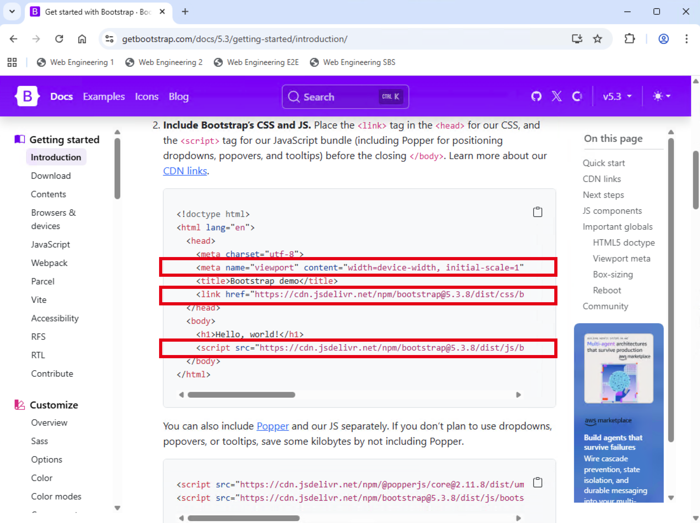
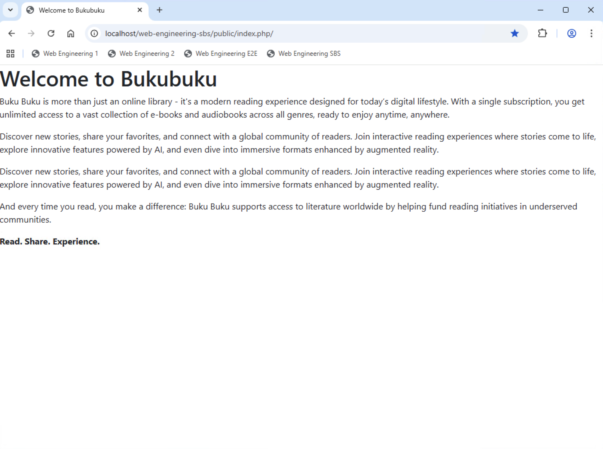
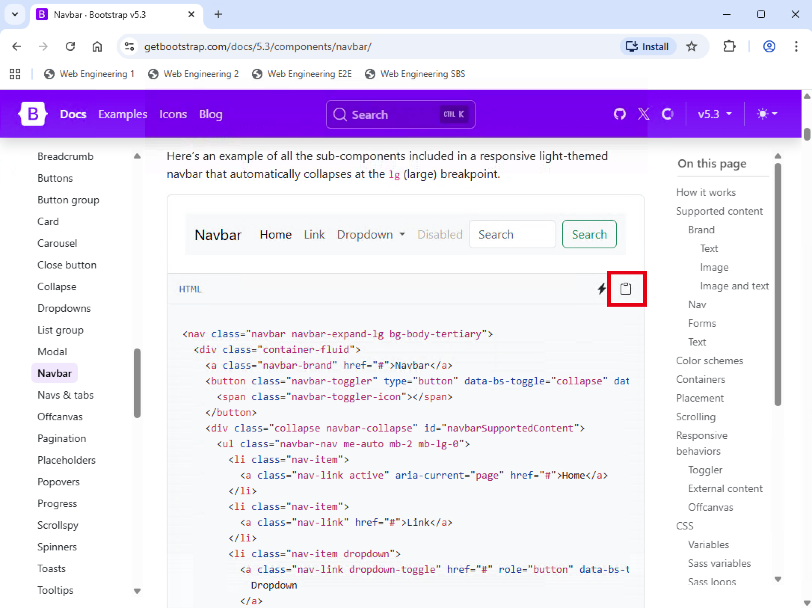
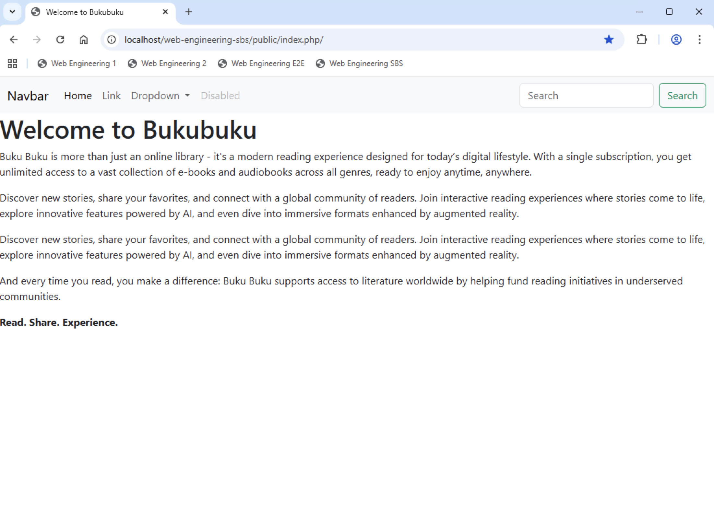
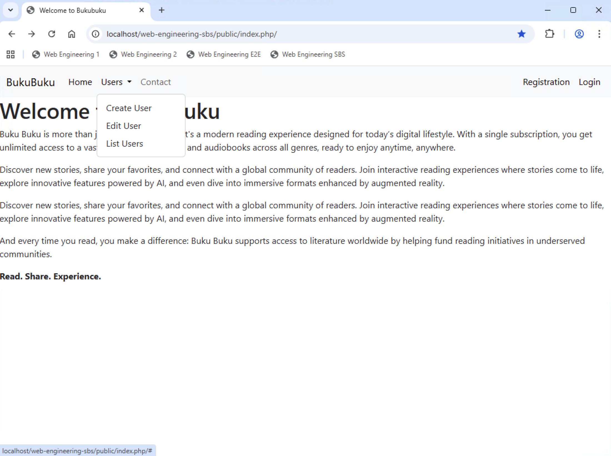
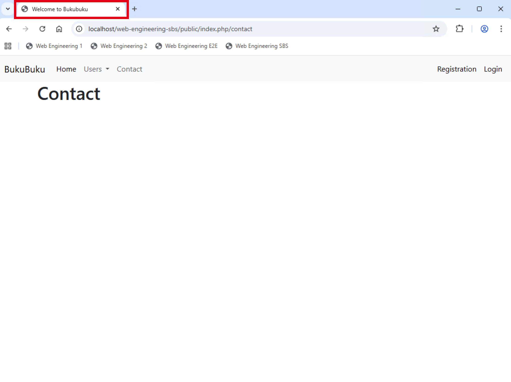

# Chapter 02: Add controllers and models

In this chapter you will build the navigtion of the application and add controllers and models.

## Explore Bootstrap and create a navigation (30 min)

Make yourself familiar with Bootstrap by visiting https://getbootstrap.com/.

Include Bootstrap's `CSS` and `JavaScript` in the `home` view as described on https://getbootstrap.com/docs/5.3/getting-started/introduction/:



When you preview the `home` view via your web browser, the formatting (in particular, the font) of the application should look different now:



Explore the `Navbar`component which you find on https://getbootstrap.com/docs/5.3/components/navbar/.

Copy the `Navbar` to the clipboard:


From the clipboard copy the `Navbar`to the `home` view. Then preview the `home` view via your web browser. It should now look like this:



Adjust the `home` view to make your navigation look like on the following screenshot:


Create two additional views and add the corresponding routes. Remember: The routes are defined in `index.php`:

- `registration.php` => Registration
- `login.php` => Login

Ensure that the navigation works properly. Example: When you click on `Contact` in the navigation, then the corresponding view should be displayed (the view will **not** have the navigation)

**Tip**: To get the `Registration` and `Login` navigation displayed on the right of the screen, you need an unordered list with the following classes: `navbar-nav ms-auto mb-2 mb-lg-0`.

## Implement layouting (30 min)

So far only the `home` view has a navigation. All views need it. You could copy & paste the navigation to every view, but this would become a **maintenance nightmare**. The application has already 8 views. Whenever you would like to make a change to the navigation, you would have to make this change eight times.

The better approach is to create a **layout** which includes the navigation and a placeholder for the content of the view. The `render` method of the `View` class, instead of directly rendering the view, renders the layout and replaces the placeholder with the content of the view.

Let's implement the required logic step by step.

Create a new folder `/views/layouts`. Create a file `main.php`in this folder. This file represents the layout.

Copy the content from `home.php` to `main.php`. Then make following adjustments:

- `main.php`: Remove the heading and the paragraphs. Instead add a placeholder:

```
<!-- This is the placeholder where the content of the view is injected. -->
<div class="container">
  {{content}}
</div>
```

- `home.php`: Remove everything except the heading and the paragraphs.

Now adjust the `View` class:

- Add a constant `LAYOUT` which stores the path to the layout file `/views/layouts/main.php`.
- Add two new private methods:
  - `private function getLayoutContent(): string`
  - `private function getViewContent(string $view, array $parameters = []): string`
- Implement both methods. The `getLayoutContent` methods gets the layout content. The `getViewContent` method gets the view content. The methods basically do the same as the `render` method. The only difference is that `getLayoutContent` works with the `LAYOUT` constant to include the file, while the `getViewContent` method works with the `view` parameter passed to the function.
- Next you adjust the `render` method itself. It has to get the layout content as well as the view content and store in two variables. Afterwards it has to replace the placeholder in the layout with the view content and return the result. Example: `return str_replace('{{content}}', $viewContent, $layoutContent);`

Test the application in the web browser. Is the navigation available and does it work properly for **all** views?

## Implement first controller (30 min)

So far you have neither created controllers nor models. Let's create a first controller. This will take care of the following parts of the application:

- Home
- Contact
- Login (will become relevant later)
- Logout (will become relevant later)

All controllers of the application are subclasses of `Bukubuku\Core\Controller`. Create this class and add a public `renderView` method to it:

- The `renderView` method has the same parameters as the `render` function of the `View` class.
- The `renderView` method creates a instance of the `View` class and calls its `render` method.

Next create a `SiteController` class inside the `/controllers` folder. This must extend the `Controller`class. Add the following methods to it:

- `public function contact(): string`
- `public function home(): string`

The two functions use the `renderView` method to render the `contact` respectively `home` view. Implement the methods.

Finally ensure that the router does not render the views itself, but instead calls the corresponding method of the controller. Instead of doing this:

```
$application->router->registerGet('/', 'home');
$application->router->registerGet('/contact', 'contact');
```

you should be able to do this:

```
$application->router->registerGet('/', [SiteController::class, 'home']);
$application->router->registerGet('/contact', [SiteController::class, 'contact']);
```

When you do `$application->router->registerGet('/', [SiteController::class, 'home'])`, the router shall resolve the path by creating an instance of the `SiteController` class and calling the `home` method of this instance. Consequently you have to adjust the `resolve` method.

Currently the `resolve` method does this:

```
        //Call the action, if it could be determined. Otherwise show 'Not found'.
        if ($action !== null) {
            if (is_callable($action)) {
                return call_user_func($action);
            } else {
                return (new View())->render($action);
            }
        } else {
            throw new NotFoundException();
        }
```

Replace this coding with the following **and understand what it does**:

```
        /*Call the action, if it could be determined. Otherwise show 'Not found'.
        The action can be a callable (i.e., a function) an array (i.e., a class and a method)
        or a string (i.e., a view).*/
        if ($action !== null) {
            if (is_callable($action)) {
                //The action is a callable (i.e., a function).
                return call_user_func($action);
            } elseif (is_array($action)) {
                //The action is an array. We need to instantiate the corresponding controller and call the method.
                [$class, $method] = $action;
                $object = new $class();
                return call_user_func_array([$object, $method], []);
            } else {
                //The action is a string (i.e., a view). Create an instance and directly render this.
                return (new View())->render($action);
            }
        } else {
            //The path is not known and hence no action could be determined.
            throw new NotFoundException();
        }
```

## Pass parameters to views (30 min)

Sooner or later you need to be able to pass parameters to views. All methods, which are relevant for the rendering of a view, allow this already:

- `Controller` class, `renderView` method
- `View` class, `render` method
- `View` class, `getViewContent` method

The `getViewContent` method needs to make the parameters available to the view.

Let's look at the current implementation of the `getViewContent` method:

```
//Get the view content.
private function getViewContent(string $view, array $parameters = [])
{
    //Start output buffering.
    ob_start();

    include_once Application::$app->rootDirectory . '/views/' . $view . '.php';

    //Return the content from the buffer and clear the buffer.
    return ob_get_clean();
}
```

Due to the way the `include_once` function works, both `$this` as well as all local variables of the `getViewContent` method are available in the included view.

Let's test this! Create a public property `title` in the `View` Class. Afterwards adjust the `contact.php` file:

```
<?php
$this->title = 'Contact';
?>

<h1><?= htmlspecialchars($this->title) ?></h1>
```

Test your application in the web browser and check if what the `contact` view displays. What happens when you change the value of the `title` property?

Let's go back to the `getViewContent` method. How can we make all parameters handed over to the method available to the view?

If you cannot think of a possibility, adjust the method as follows **and understand what it does**:

```
private function getViewContent(string $view, array $parameters = []): string
{
    //Start output buffering.
    ob_start();

    //Make the parameters passed to this method available to the view.
    foreach ($parameters as $key => $value) {
        $$key = $value;
    }

    include_once Application::$app->rootDirectory . '/views/' . $view . '.php';

    //Return the content from the buffer and clear the buffer.
    return ob_get_clean();
}
```

Let's test this by passing a parameter to the `home` view:

- Adjust the corresponding method in the `SiteController`class and pass a parameter there.
- Then use this parameter in the view.
- If you cannot think of a good parameter, make it possible to pass a name (e.g. `Bukubuku`) which is used in the heading of the `home` view.

Finally adjust **all** views: Use the `title` property to fill the heading (just like you did for the `contact` view).

## Use title for the browser window (15 min)

Currently the browser window (the tab) is always called 'Welcome to Bukubuku.



Instead it should correspond to the `H1` heading of the view (which corresponds to the `title` property of the view). Example: When the `contact` view is displayed, the browser windows (the tab) should be called 'Contact'.

How can you achieve this?

- You can use the `title` property in `main.php` to set the title just like you use it in the views to set the `H1` heading.
- **Precondition for this to work**: In the `render` method of the `View` class you first have to call `getViewContent` and **afterwards** `getLayoutContent`, because the `title` property is currently filled in the view.

```
$viewContent = $this->getViewContent($view, $parameters);
$layoutContent = $this->getLayoutContent();
```
