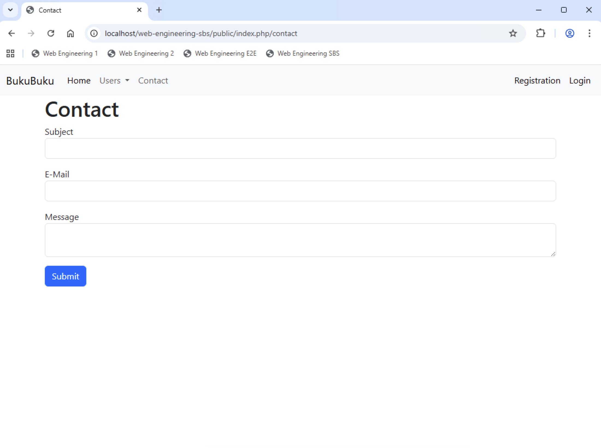

# Chapter 03: Implement a first model and do input validation

In this chapter you will build the first model and a generic approach to input validation in the application.

## Create the contact form (15 min)

Use the `Form` component from https://getbootstrap.com/docs/5.3/forms/overview/ to adjust the `contact` view to look like this:



Ensure that the form sends the data via the `POST` method. Then test what happens when you submit the form.

You should get an error. This errors happens, because you do not have a route for the `POST` method. Add the route in `index.php` and ensure that the route uses a **new** `handleContact` method in the `SiteController` class. The `handleContact` method shall return the string 'We will contact you soon'.

## Create the first model (30 min)

When the user submits the form on the `contact` view, you need to validate the data. For this you have to create your first model. This will validate the data. If the data is valid, it will process the contact form.

All models of the application are subclasses of `Bukubuku\Core\Model`. This class shall fulfill the following requirements:

- The class shall be abtract. It shall know nothing about the attributes of concrete models (i.e. the subclasses).
- The class shall have a private property to capture validation errors: `private array $errors = []`
- The class shall implement methods common to all models. For now, it requires the following methods:
  - `static public function getPropertyNames(): array`
  - `static public function getLabel($property): string`
  - `static public function fromHttp(array $data)`
  - `protected function __construct(array $properties = [], array $errors = [])`
  - `public function validateData(): bool`
  - `protected function addError(string $propertyName, string $message)`
  - ` public function hasError(string $property = ''): bool`
  - `public function getFirstError(string $property): string`

- The class shall specify which methods must be implemented by subclasses. For now, subclasses need to implement the following methods:
  - `static abstract protected function getRulesets(): array`
  - `static abstract protected function propertyMapping(): array`

Create the class `Bukubuku\Core\Model` including the aforementioned methods. Do not bother about the implementation of the methods yet. **When a return value is expected, simply return an empty array, an empty string or `true`.**

Next create a `Contact` class inside the `/models` folder. This must extend the `Model`class. Add the following properties and methods to it:

- Add one property per form field:
  - `public string $subject = ''`
  - `public string $email = ''`
  - `public string $message = ''`
- `static protected function getRulesets(): array`
- `static protected function propertyMapping(): array`
- `public function process(): bool`

Now your first model exists, but all the model logic is still missing. Don't worry. We will add this step by step.

## Use the model in the controller (45 min)

Let's take a look at what the controller has to do in the `handeContact` method. Add the following code:

```
        //Get the data from the (POST) request.
        //TODO

        //Validate the data.
        if ($contact->validateData() == true) {
            if ($contact->process() == true) {
                //Context requests was successful.
                //TODO
                return 'We will contact you soon';
            } else {
                //Contact request was not successful.
                //TODO
                return 'We will NOT contact you';
            }
        } else {
            //Validation has errors.
            //TODO
            return 'Errors';
        }
```

Before you can call the `valideData` method, you need to create an instance of the `Contact` class. Where can you get the data for this instance from?

You can get the data from the request which is send when the user submits the form on the `contact` view. Implement two new methods in the `Request` class:

- `public function getParameters(): array` (this method shall read the data either from $\_GET or $POST and apply `filter_input` on every parameter, it shall return all parameters as array)
- `public function getParameter($key): mixed` (this method shall call the `getParameters` method and return the parameter which is specified by `key`)

Now you can call the `getParaneters` function in the `handleContact` method and pass the result to the `fromHttp` method of the `Model` class:

```
//Get the data from the (POST) request.
$contact = Contact::fromHttp(
       ['properties' => Application::$app->request->getParameters()]
);
```

The implementation of the `fromHttp` method is a bit tricky. It receives an array and expects this arrays to have up to two entries:

- one entry `properties` which contains the values of the properties of the model; The model can, for example, be the `Contact` model.
- one entry `errors` which contains the errors collected; We only need this entry later. For now ignore it.

The `fromHttp` method shall call the constructor of the model. The constructor of the model expects two arrays. The implementation of the `fromHttp` method has to look as follows:

```
static public function fromHttp(array $data)
{
  return new static($data['properties'] ?? [], $data['errors'] ?? []);
}
```

Set a breakpoint in the constructor of the `Model` class and check that all the data you have entered in the form is passed to the constructor. If not, debug and fix the program.

Now you can implement the constructor of the `Model` class. **The constructor must work for all subclasses of the `Model` class:**

- The constructor has to iterate over all properties passed to the constructor. If the property exists in the class, it has to set the value. If the property does not exist in the class, it can ignore it.
- The constructor must also set the errors passed to the constructor.

If you do not manage to implement the constructor, you can use the following coding:

```
protected function __construct(array $properties = [], array $errors = [])
{
  //Iterate over all parameters and split them into the name and value of the property.
  foreach ($properties as $propertyName => $propertyValue) {
  //If a property with the name exists, then we set the value of this property.
  //Otherwise we ignore this parameter.
    if (property_exists($this, $propertyName)) {
      $this->{$propertyName} = $propertyValue;
    }
  }

  //Set the messages.
  $this->errors = $errors;
}
```

Set a breakpoint in the `validateData` of the `Model` class and check that the properties of the model are correctly set.

## Build the validation (90 min)

You have come a long way. Next you need to validate the data. There are two options you can do this:

- You can implement the validation in the `Contact` model and subsequently in all other models you create by extending the `Model` class. This would be straightforward. It would also mean that you would probably create a lot of duplicate coding in all the various models the application needs.
- You can implement the validation in the `Model` class. But then the `Model` class needs to know which rules shall apply to instances of the `Contact` class (as well as to instances of all other subclasses).

You will go forward with the second option. This will be additional work now, but it will make things much easier when we create more models later. Here the `propertyMapping` and the `getRulesets` method come into play. Implement them for the `Contact` class:

The `propertyMapping` method is easy. It shall return all properties the `Contact` class has. Later we also need the text which shall be displayed on the UI for each of the properties. Hence the method returns an associative array:

- The key is the property name.
- The value is the UI text for the property.

Implement the `propertyMapping` method.

The `getRulesets` method is more complicated. Let's do this together.

- First you have to create a new class `Bukubuku\Core\Rule`. For now it has to look like this:

```
class Rule
{
    public const REQUIRED = 'required';
    public const EMAIL = 'email';
}
```

- Next you can implement the `getRulesets` method. For now it can look like this.

```
    static protected function getRulesets(): array
    {
        return [
            'subject' => [
                Rule::REQUIRED => [],
            ],
            'email' => [
                Rule::REQUIRED => [],
                Rule::EMAIL => []
            ],
            'message' => [
                Rule::REQUIRED => [],
            ]
        ];
    }
```

What does the `getRulesets` method do? The method is supposed to return an associative array:

- The key is a property of the class.
- The value is another associative array which represents the set of rules relevant for the property:
  - The key is the rule.
  - The value is an array which can include additional information required to apply the rule (for the `Contact` class we do not need any additional information).

For the `Contact` class the array has the following entries:

- `subject`: The property is mandatory.
- `email`: The property is mandatory. The property has to be a valid eMail.
- `message`: The property is mandatory.

Your next task is to implement the `validateData` method. The method must do the following:

- Ensure that the `error` property is empty.
- Get the rulesets via the `getRulesets` method.
- Iterate over the rulesets and do the validation for each rule.
- If a rule is not fulfilled, add an error message via the `addError` method.
- At the end of the method, return `true` if the validation was successful (i.e., there are no entries in the `errors` property). Otherwise return `false`.

Next implement also the following three methods:

- `addError`
- `hasError`
- `getFirstError`

To test that the validation works correctly do the following:

- Make the `errors` property public.
- Adjust the `handleContact` method. When there are errors, it shall return `json_encode($contact->errors)`.

Test your form.

## 'Hack' the process method (15 min)

You will not 'really' implement the processing of the form. To 'simulate' different outcomes, change the `process` method of the `Contact` class as follows.

- The method shall return `false` when the subject equals 'Send an error'.
- In all other cases the method shall return `true`.

Test your form.
