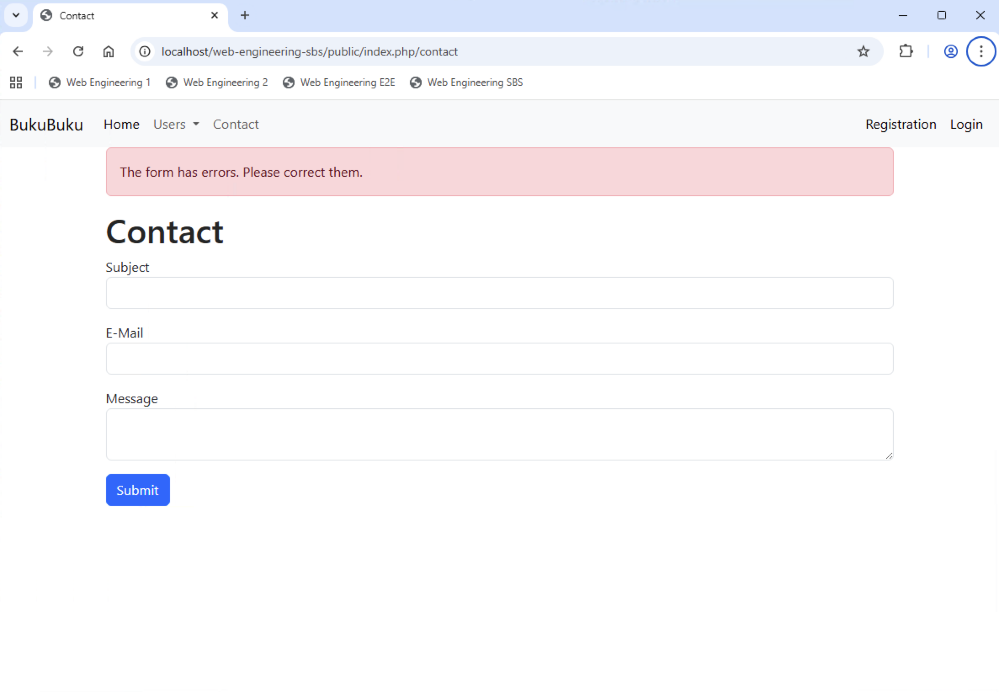

# Chapter 04: Implement a first model and do input validation

Implement flash memory and post-redirect-get pattern for the application. Flash memory refers to temporary session data that persists only for the next HTTP request and is then automatically cleared.

## Enhance the Response class (15 min)

You need to be able to redirect the user and set HTTP response codes. Therefore enhance the reponse class as follows:

```
class Response
{

    public function getScriptName(): string
    {
        return $_SERVER['SCRIPT_NAME'];
    }

    public function redirect(string $path): void
    {
        header('Location: ' . $this->getScriptName() . $path);
    }

    public function setResponseCode(int $code): void
    {
        http_response_code($code);
    }
}
```

## Create a Session class and implement flash memory (30 min)

You also need to be able to create a session and use the session memory, e.g. for the flash memory as well as for the login system.

Create a `Bukubuku\Core\Session` class. Implement the following methods:

- `public function __construct()`: Whenever the constructor is called you have to create a new PHP session.
- `public function set($key, $value)`: Write to the session, i.e. the superglobal `$_SESSION`.
- `public function get($key)`: Read from the session.
- `public function unset($key)`: Delete from the session.

For the flash memory you create a constant `FLASH_MEMORY_KEY`(with whatever value you like) in the `Session class`. You write to the flash memory as follows:

```
$_SESSION[Session::FLASH_MEMORY_KEY][$key] = [
  'value' => $value,
  'remove' => false
];
```

Create the following methods to write to and read from the flash memory:

- `public function setFlashMemory(string $key, $value)`
- `public function getFlashMemory(string $key)` - this method shall only remove the `value`

The next step is a bit complicated to explain and implement. As mentioned above, the flash memory needs to be cleared after the next HTTP request. The basic idea to achieve this is the following:

- When you write data to the flash memory, you set `remove` to `false` (see the `setFlashMemory`method).
- At the beginning of an HTTP request, a new instance of the `Session` class is created. Remember that HTTP is stateless, i.e. whatever instance of whatever class you create, it gets destroyed at the end of the HTTP request. When a new instance of the `Session` class is created, the constructor is called. In the constructor the flash memory **cannot** be cleared. Otherwise the flash memory would not be availble for the HTTP request at all. It can only be cleared after - or at the very end - of the HTTP request. Therefore you set `remove` to true to signal what needs to be cleared a the end of the HTTP request.
- At the very end of an HTTP request, the instance of the `Session` class is destroyed and the destructor is called. In the destructor you (only) delete those entries from the flash memory with `remove == true`. This ensures that everything which was written to the flash memory during the current HTTP request stays in the flash memory (for the next HTTP request), but everything from earlier HTTP requests gets cleared.

Add the following lines to the constructor:

```
/*The constructor of the Session class is called at the beginning of any HTTP request.
Everything stored in the flash memory at this point of time, needs to be removed at the
end of the HTTP request. Therefore it is marked correspondingly.*/
$flashMemory = $_SESSION[Session::FLASH_MEMORY_KEY] ?? [];
foreach ($flashMemory as $key => &$content) {
    $content['remove'] = true;
}
$_SESSION[Session::FLASH_MEMORY_KEY] = $flashMemory;
```

In addition create a destructor as follows:

```
public function __destruct()
{
    /*The destructor of the Session class is called at the end of any HTTP request.
    Everything which was stored in the flash memory at the beginning of the HTTP request,
    is now removed from the flash memory. */
    $flashMemory = $_SESSION[Session::FLASH_MEMORY_KEY] ?? [];
    foreach ($flashMemory as $key => $content) {
        if ($content['remove'] == true) {
            unset($flashMemory[$key]);
        }
    }
    $_SESSION[Session::FLASH_MEMORY_KEY] = $flashMemory;
}
```

Finally ensure that a new instance of the `Session` class is created and added as instance attribute (just like `Request` and `Response`) in the constructor of the `Application` class.

## Use flash memory in controller (30 min)

Now you can use the flash memory in the `SiteController`. When the contact form was processed, you redirect the user to the homepage. You can use the `redirect` method you have just implemented.

Test that the redirection works.

You want to ensure that the user gets a success or error message (on the homepage). How can you do that?

You can write the message to the flash memory in the `SiteController`and then read it from the flash memory later. Let's do that.

- Add the following methods to the `Application` class and try to understand what they do:

  ```
    //Write to the flash memory (encapsulates session).
    public function setFlashMemory($key, $value)
    {
        $this->session->setFlashMemory($key, $value);
    }

    //Read from the flash memory (encapsulates session).
    public function getFlashMemory($key)
    {
        return $this->session->getFlashMemory($key);
    }

    //Write a success message to the flash memory.
    public function setFlashSuccessMessage(string $message)
    {
        $this->session->setFlashMemory('success', $message);
    }

    //Read the success message from the flash memory.
    public function getFlashSuccessMessage(): string
    {
        return $this->session->getFlashMemory('success');
    }

    //Write an error message to the flash memory.
    public function setFlashErrorMessage(string $message)
    {
        $this->session->setFlashMemory('error', $message);
    }

    //Read the error message from the flash memory.
    public function getFlashErrorMessage(): string
    {
        return $this->session->getFlashMemory('error');
    }
  ```

- Replace the `return 'We will contact you soon'` and `return 'We will NOT contact you'` in the `SiteController` class with the required method calls to write a sucess respectively error message to the flash memory.
- Then make change to the `main.php` layout to read the success respectively error message from the flash memory. Using `main.php` instead of `home.php` has the advantage that all views will be able to display success and error messages. Add the following lines before the placeholder where the content of the view is injected.
  ```
    <!-- Here we display the flash messages. -->
    <div class="container">
        <?php if (Application::$app->session->getFlashMemory('success')): ?>
            <div class="alert alert-success"><?= htmlspecialchars(Application::$app->session->getFlashMemory('success')) ?></div>
        <?php elseif (Application::$app->session->getFlashMemory('error')): ?>
            <div class="alert alert-danger"><?= htmlspecialchars(Application::$app->session->getFlashMemory('error')) ?></div>
        <?php endif; ?>
    </div>
  ```
- Ensure that `main.php` knows `Bukubuku\Core\Application`.

Test the redirection again and confirm that the messages are displayed as expected.

## Display message from form validation (45 min)

Take another look at the `SiteController` class. Ensure that whenever the form has errors (the validation is not succesful), the user is redirected to the form itself and an error message is displayed:


Finally you need to also display the errors from the validation. How can you do this?

You need to ensure that the instance of the `Contact` model is written to the flash memory in case of errors. And you need to ensure that is is read from the flash memory (if it exists there).

- Add the following method to the `Model` class: `public function toHttp(): array`:

  ```
    public function toHttp(): array
    {

        $propertyNames = self::getPropertyNames();
        $properties = [];

        foreach ($propertyNames as $propertyName) {
            $properties[$propertyName] = $this->{$propertyName};
        }

        return [
            'properties' => $properties,
            'errors' => $this->errors
        ];
    }

  ```

- Implement the already existing methods in the `Model` class:

  ```
    static public function getPropertyNames(): array
    {
        return array_keys(static::propertyMapping());
    }

    static public function getLabel($property): string
    {
        return static::propertyMapping()[$property] ?? $property;
    }
  ```

- Ensure that the following code is executed in case of validation errors (in `SiteController`):
  ```
    //Validation has errors.
    Application::$app->setFlashErrorMessage('The form has errors. Please correct them.');
    Application::$app->setFlashMemory(Contact::class, $contact->toHttp());
    Application::$app->response->redirect('/contact');
    return null;
  ```
- Change the `contact` method (in `SiteController`):
  ```
    public function contact(): string
    {
        $contact = Contact::fromHttp(Application::$app->getFlashMemory(Contact::class) ?? []);
        return $this->renderView('contact', ['model' => $contact]);
    }
  ```

Currently a form field looks like this (in `contact.php`):

```
    <div class="mb-3">
        <label for="subject">Subject</label>
        <input type="text" id="subject" name="subject" class="form-control">
    </div>
```

You need to change this **for all form fields** and add both the value from the model as well as potential validation errors:

```
    <div class="mb-3">
        <label for="subject">Subject</label>
        <input type="text" id="subject" name="subject" class="form-control <?= $model->hasError('subject') ? 'is-invalid' : ''  ?>" value="<?= $model->subject ?>">
        <div class="invalid-feedback">
            <?= $model->getFirstError('subject') ?>
        </div>
    </div>
```

Test your form until it behaves as expected.
