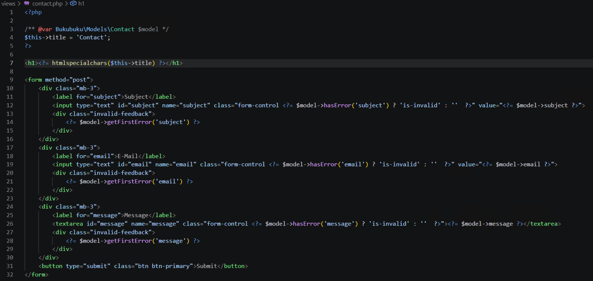

# Chapter 05: Improve form handling

In this chapter we create a few classes that help us to define forms.

Take a look at the `contact.php` file:



It works, but it is also prone to errors. Everytime you like to add another field, you have to:

- Create a new `<div>`, `<label>` as well as `<input>`.
- You need to set the `id` as well as `name`.
- You also need to add code to populate the `value` and display errors (in case there are).

It would be much better, if you could define the contact form as follows:

```
<?= $form->start(); ?>
<?= $form->field(Field::TEXT, 'subject'); ?>
<?= $form->field(Field::EMAIL, 'email'); ?>
<?= $form->textarea('message') ?>
<?= $form->button(Button::SUBMIT, 'submit', 'Submit') ?>
<?= $form->end(); ?>
```

## Create Form class (15 min)

First you create a `Form` class in namspeace `Bukubuku\Core\Form`, i.e. in folder `...core/form`.

Create a constructor: `public function __construct(string $action, string $method, Model $model, bool $readonly = false)`

For each parameter create a public attribute in the class and fill it from the constructor.

Add the following two methods and understand what they do:

```
    //Print the start tag of the form.
    public function start(): string
    {
        return sprintf('<form action="%s" method="%s">', htmlspecialchars($this->action), htmlspecialchars($this->method)) . PHP_EOL;
    }

    //Print the end tag of the form.
    public function end(): string
    {
        return '</form>' . PHP_EOL;
    }
```

Finally replace the HTML tags in `contact.php` with calls of the `start` respectively `end` methods. Test that the form still works as expected.

## Create Button class (30 min)

Next you create a `Button` class in the same namespace as the `Form` class. The constructor of this class look as follows: `public function __construct(string $type, string $buttonName, string $buttonText, Form $form, bool $readonly = false)`.

The class has a public constant `SUBMIT` with value `submit`. For each parameter of the constructor a public attribute exists.

The constructor fills all attributes. **Pecularity**: If the form is readonly, then the button also has to be readonly. Ensure this in the constructor.

Add the following method and understand what it does:

```
    //Print the button.
    public function __toString()
    {
        return sprintf(
            '<button type="%s" id="%s" name="%s" %s class="btn btn-primary">%s</button>',
            htmlspecialchars($this->type),
            htmlspecialchars($this->buttonName),
            htmlspecialchars($this->buttonName),
            htmlspecialchars($this->readonly ? 'disabled' : ''),
            htmlspecialchars($this->buttonText)
        );
    }
```

Then add the following method to the **`Form`** class and implement it:

```
    //Add a button to the form.
    public function button(string $type, string $buttonName, string $buttonText, bool $readonly = false): Button
    {
        //YOUR CODE
    }
```

Finally replace the button tag in `contact.php` with an instance of the new `Button` class.

## Create Field class (45 min)

Next you create a `Field` class in the same namespace as the `Form` class. This has the following constants and attributes:

```
    //Currently we only support the following types. Additional ones could be added.
    public const TEXT = 'text';
    public const EMAIL = 'email';
    public const PASSWORD = 'password';
    public const DATE = 'date';
    public const DATETIME = 'datetime-local';
    public const NUMBER = 'number';
    public const HIDDEN = 'hidden';

    //Attributes of the field
    public string $type;
    public string $propertyName;
    public bool $readonly;
    public Form $form;
```

Implement the following methods similarly to how you did it for the button:

- `public function __construct(string $type, string $propertyName, Form $form, bool $readonly = false)`
- `public function __toString()`
- `public function field(string $type, string $propertyName, bool $readonly = false): Field` in the **`Form`** class

The implementation must be suitable to replace the field tags in `contact.php` with instances of the `Field` class.

## Create Textarea class (45 min)

You have come very far. Now it should be piece of cake for you to implement one more class for text areas: `Textarea`.
The constructor looks like this: `public function __construct(string $propertyName, Form $form, bool $readonly = false)`

When you are done the `contact.php` file should look like this:

```
<?php

/** @var Bukubuku\Models\Contact $model */

use Bukubuku\Core\Form\Form;
use Bukubuku\Core\Form\Button;
use Bukubuku\Core\Form\Field;

$this->title = 'Contact';
$form = new Form('', 'post', $model);
?>

<h1><?= htmlspecialchars($this->title) ?></h1>

<?= $form->start() ?>
<?= $form->field(Field::TEXT, 'subject'); ?>
<?= $form->field(Field::EMAIL, 'email'); ?>
<?= $form->textarea('message') ?>
<?= $form->button(Button::SUBMIT, 'submit', 'Submit') ?>
<?= $form->end() ?>
```
