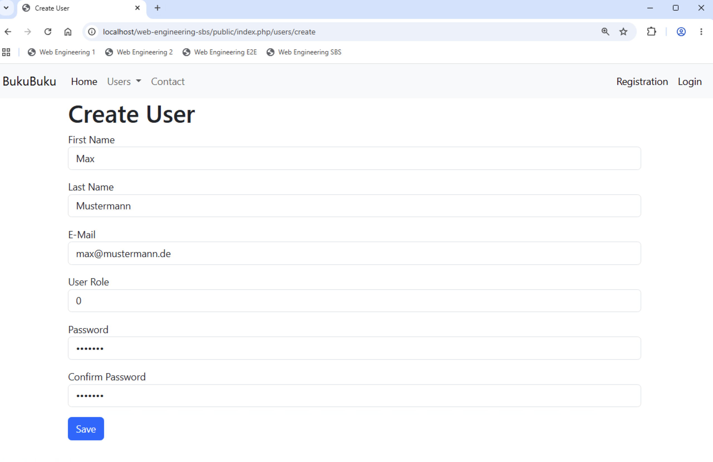

# Chapter 06: Connect to the database

In this chapter we will connect the application to the database. At the end of the chapter we will be able to create new users.

## Create Database class (30 min)

To connect and interact with the database, we use PHP Data Objects (PDO). We use a `Database` class to encapsulate the interaction with PDO.

Create the `Database` class in namspeace `Bukubuku\Core`. Add the following coding:

```
<?php

namespace Bukubuku\Core;

use Bukubuku\Core\exception\DatabaseException;

class Database
{

    /*Instance of PDO class. We define is as private and channel all
    communication with the database through the Database class.*/
    private \PDO $pdo;

    public function __construct(string $dsn, string $username, string $password)
    {
        try {
            $this->pdo = new \PDO($dsn, $username, $password);
        } catch (\Exception $exception) {
            throw new DatabaseException();
        }

        //Throw exceptions in case of errors.
        $this->pdo->setAttribute(\PDO::ATTR_ERRMODE, \PDO::ERRMODE_EXCEPTION);

        //Set the fetch mode to FETCH_ASSOC.
        $this->pdo->setAttribute(\PDO::ATTR_DEFAULT_FETCH_MODE, \PDO::FETCH_ASSOC);
    }

    //Prepare a statement.
    public function prepare(string $query): \PDOStatement|false
    {
        try {
            return $this->pdo->prepare($query);
        } catch (\Exception $exception) {
            throw new DatabaseException();
        }
    }

    //The following three methods are used for transaction handling.
    //Begin a new transaction.
    public function beginTransaction(): bool
    {
        try {
            return $this->pdo->beginTransaction();
        } catch (\Exception $exception) {
            throw new DatabaseException();
        }
    }

    //Commit the running transaction.
    public function commit(): bool
    {
        try {
            return $this->pdo->commit();
        } catch (\Exception $exception) {
            throw new DatabaseException();
        }
    }

    //Rollback the running transaction.
    public function rollback(): bool
    {
        try {
            return $this->pdo->rollBack();
        } catch (\Exception $exception) {
            throw new DatabaseException();
        }
    }
}
```

Understand what the different methods of the `Database` class do.

Finally ensure that a new instance of the `Database` class is created and added as instance attribute `$db` (just like `Request` and `Response`) in the constructor of the `Application` class. The constructors needs additional parameters `$dsn`, `$username` and `$password`.

You need to pass the additional parameters to the constructor in the `index.php` file. For now, you can hardcode them. Afterwards test that the instance of the `Database` class is created and added as instance attribute as expected.

Hardcoded database credentials in `index.php` is nothing you want to have in real life. Therefore create an `.env` file to store them and use `https://github.com/vlucas/phpdotenv` to load them. If you need help, here are the exact steps:

- Create the `.env` file in the root directory of your application with the following content:

```
DB_DSN=mysql:host=localhost;dbname=bukubuku;charset=UTF8
DB_USERNAME=root
DB_PASSWORD=root
```

- Run `composer require vlucas/phpdotenv` in the root directory of your application.
- Add the following lines to the `index.php`file:

```
//Load the content from the .env file.
$dotenv = Dotenv\Dotenv::createImmutable(dirname(__DIR__));
$dotenv->load();
```

- Create the instance of the `Application` class as follows (**check that the order of the parameters fits to how you rhave defined the constructor**):

```
//Create the application.
$application = new Application(
    $_ENV['DB_DSN'],
    $_ENV['DB_USERNAME'],
    $_ENV['DB_PASSWORD'],
    dirname(__DIR__)
);
```

## Create DatabaseModel class (45 min)

In chapter 03 we have created `Bukubuku\Core\Model` and said that all models of the application would be subclasses of this `Model` class. The `Model` class has methods common to all models, but it is not able to connect to the database.

The `Contact` model is a subclass of the `Model` class. That works perfectly well, because it does not have to connect to the database.

To be able to create new users, we need the (not yet created) `User` model to connect to the database. We will achieve this by doing the following:

- We will create a new `DatabaseModel` class.
- The new class will be a subclass of the `Model` class. It will implement various methods required to read and write data to the database.
- It will also define (additional) abstract methods.
- A model which is supposed to connect to the database, e.g. the `User` model, will be a subclass of the `DatabaseModel` class. As such it will have to implement all abstract methods defined by the `Model` class (and **not** implemented by the `DatabaseModel` class) as well as all abstract methods defined by the `DatabaseModel` class.

Sounds a bit complicted? Let's go through what is required step-by-step.

First let's take a look at the methods of the `DatabaseModel` class. The `DatabaseModel` class implements the following methods:

- `static public function checkExistence(int $primaryKeyValue): bool`
- `static public function columnToProperty(string $column): string|null`
- `static public function fromDatabase($primaryKeyValue)`
- `static public function getAll(int $page = 0, int $limit = 10): array`
- `static public function getColumnNames(): array`
- `static public function prepare($query)`
- `static public function propertyToColumn(string $property): string|null`
- `static protected function addAlias(string $column): string`
- `public function insert(): bool`
- `public function update(array $properties = []): bool`
- `protected function isUnique(string $propertyName): bool`

The `DatabaseModel` class specifies the following abstract methods, which have to be implemented by subclasses:

- `static abstract protected function getTableName(): string`
- `static abstract protected function getPrimaryKeyName(): string`
- `static abstract protected function columnMapping(): array`

The general idea is that the `DatabaseModel` class does all the work, but gets required (meta-) data from the subclasses. For example, the `DatabaseModel` class has all the coding required to insert a new record into the database. It does not know the table name or column names though. The abstract methods (which will be implemented by the subclasses) return the table name and column names. This ensures that the coding of the `DatabaseModel` class works equally for users, books as well as checkouts.

Create the class `Bukubuku\Core\DatabaseModel` and add the following coding:

```
<?php

namespace Bukubuku\Core;

abstract class DatabaseModel extends Model
{
    /*The following abstract methods have to be implemented in subclasses.
    They include database-related information:
    - getTableName: get the name of the database table used to store data from this model
    - getPrimaryKeyName: get the name of the primary key column (currently only a single column
      can be used as primary key)
    - columnMapping: map the column=>property*/
    static abstract protected function getTableName(): string;
    static abstract protected function getPrimaryKeyName(): string;
    static abstract protected function columnMapping(): array;

    //Check if a record with a given primary key value does already exist.
    static public function checkExistence(int $primaryKeyValue): bool
    {
        $tableName = static::getTableName();
        $primaryKeyName = static::getPrimaryKeyName();

        //Create SQL statement.
        $query = "SELECT COUNT(*) FROM $tableName WHERE $primaryKeyName = :$primaryKeyName;";
        $statement = static::prepare($query);

        //Bind the parameter and execute the statement.
        $statement->bindValue(":$primaryKeyName", $primaryKeyValue);
        $statement->execute();
        return $statement->fetchColumn();
    }

    //Determine the property for a given column.
    static public function columnToProperty(string $column): string|null
    {
        if (array_key_exists($column, static::columnMapping())) {
            return static::columnMapping()[$column];
        } else {
            return null;
        }
    }

    //Create a new instance of the model by reading the database.
    static public function fromDatabase($primaryKeyValue)
    {
        $tableName = static::getTableName();
        $columnNames = static::getColumnNames();
        $columnsWithAlias = array_map(fn($columnName) => static::addAlias($columnName), $columnNames);
        $primaryKeyName = static::getPrimaryKeyName();

        //Create SQL statement.
        $query = 'SELECT ' . implode(', ', $columnsWithAlias)  . ' FROM ' . $tableName . ' WHERE ' . $primaryKeyName . '= :' . $primaryKeyName . ';';
        $statement = static::prepare($query);

        //Execute the statement.
        $statement->execute([$primaryKeyName => $primaryKeyValue]);
        $properties = $statement->fetchAll()[0];

        return new static($properties);
    }

    //Read all records from the database. The function supports paging.
    static public function getAll(int $page = 0, int $limit = 10): array
    {
        $tableName = static::getTableName();
        $columnNames = static::getColumnNames();
        $columnsWithAlias = array_map(fn($columnName) => static::addAlias($columnName), $columnNames);

        //Create SQL statement.
        $query = 'SELECT ' . implode(', ', $columnsWithAlias)  . ' FROM ' . $tableName;
        if ($page != 0) {
            $query = $query . ' LIMIT :limit OFFSET :offset;';
            $offset = ($page - 1) * $limit;
        } else {
            $query = $query . ';';
        }

        $statement = static::prepare($query);

        //Bind the parameters.
        if ($page != 0) {
            $statement->bindValue(':limit', $limit, \PDO::PARAM_INT);
            $statement->bindValue(':offset', $offset, \PDO::PARAM_INT);
        }

        //Execute the statement.
        $statement->execute();
        return $statement->fetchAll();
    }

    //Get all columns of the database table.
    static public function getColumnNames(): array
    {
        return array_keys(static::columnMapping());
    }

    //Prepare SQL statement.
    static public function prepare($query)
    {
        return Application::$app->db->prepare($query);
    }

    //Determine the column for a given property.
    static public function propertyToColumn(string $property): string|null
    {
        $column = array_search($property, static::columnMapping());
        if ($column != false) {
            return $column;
        } else {
            return null;
        }
    }

    //Add an alias to column.
    static protected function addAlias(string $column): string
    {
        $alias = static::columnToProperty($column);
        return "$column AS $alias";
    }

    //Insert the instance of the model into the database.
    public function insert(): bool
    {
        $tableName = static::getTableName();
        $columnNames = static::getColumnNames();
        $parameters = array_map(fn($columnName) => ":$columnName", $columnNames);

        //Create SQL statement.
        $query = 'INSERT INTO ' . $tableName .  ' (' . implode(', ', $columnNames) . ') VALUES (' . implode(', ', $parameters) . ');';
        $statement = static::prepare($query);

        //Bind the parameters.
        foreach ($columnNames as $columnName) {
            $propertyName = static::columnToProperty($columnName);
            if ($propertyName != null) {
                $value = $this->{$propertyName};
                //Implement special logic for DateTime
                if ($value instanceof \DateTime) {
                    //$value = $value->format('Y-m-d');
                    $value = $value->format('Y-m-d H:i:s');
                }
            } else {
                $value = null;
            }

            $statement->bindValue(":$columnName", $value);
        }

        //Execute the statement.
        return $statement->execute();
    }

    //Update the instance of the model in the database.
    public function update(array $properties = []): bool
    {
        $tableName = static::getTableName();
        $primaryKeyName = static::getPrimaryKeyName();
        if (empty($properties)) {
            $columnNames = static::getColumnNames();
        } else {
            $columnNames = [];
            foreach ($properties as $property) {
                array_push($columnNames, static::propertyToColumn($property));
            }
        }
        $columnNames = array_diff($columnNames, [$primaryKeyName]);
        $columnNamesWithParameters = array_map(fn($columnName) => "$columnName = :$columnName", $columnNames);

        //Create SQL statement.
        $query = 'UPDATE ' . $tableName . ' SET ' . implode(', ', $columnNamesWithParameters) .
            ' WHERE ' . $primaryKeyName . ' = :' . $primaryKeyName . ';';
        $statement = static::prepare($query);

        //Bind the parameters.
        $primaryKeyPropertyName = static::columnToProperty($primaryKeyName);
        $statement->bindValue(":$primaryKeyName", $this->{$primaryKeyPropertyName});
        foreach ($columnNames as $columnName) {
            $propertyName = static::columnToProperty($columnName);
            if ($propertyName != null) {
                $value = $this->{$propertyName};
                //Implement special logic for DateTime
                if ($value instanceof \DateTime) {
                    $value = $value->format('Y-m-d H:i:s');
                }
            } else {
                $value = null;
            }

            $statement->bindValue(":$columnName", $value);
        }

        //Execute the statement.
        return $statement->execute();
    }

    //Check if the value of a the given property is unique and does not already exist in the database.
    protected function isUnique(string $propertyName): bool
    {
        $tableName = static::getTableName();
        $primaryKeyName = static::getPrimaryKeyName();
        $columnName = static::propertyToColumn($propertyName);

        //Create SQL statement.
        $query = "SELECT COUNT(*) FROM $tableName WHERE $primaryKeyName <> :$primaryKeyName AND $columnName = :$columnName;";
        $statement = static::prepare($query);

        //Bind the parameter and execute the statement.
        $value = $this->{$this->columnToProperty($primaryKeyName)};
        $statement->bindValue(":$primaryKeyName", $value);
        $value = $this->{$propertyName};
        $statement->bindValue(":$columnName", $value);
        $statement->execute();
        return !$statement->fetchColumn();
    }

}
```

Try to understand - at least roughly - what the various methods of the `DatabaseModel` class do and how they work.

## Create User model (45 min)

Let's implement a `User` model, similar to `Contact` model. It needs to inherit from the `DatabaseModel` class and it needs to be part of the `models` folder.

Which properties does the `User` model need? Add the following properties:

```
    //Properties of the model
    public int $userId = 0;
    public string $firstName = '';
    public string $lastName = '';
    public string $email = '';
    public string $password = '';
    //The UI needs a second field to confirm the password.
    public string $confirmPassword = '';
    //And a boolean is treated as TINYINT by MySQL.
    public int $isAdmin = 0;
```

Implement all abstract methods inherited from `DatabaseModel`. Can you do this on your own? Or do you need help?

In case you need help, you can find the required coding here:

- Create the `getTableName` method.

```
    static protected function getTableName(): string
    {
        return 'users';
    }
```

- Create the `getPrimaryKeyName` method.

```
    static protected function getPrimaryKeyName(): string
    {
        return 'user_id';
    }
```

- Create the `columnMapping` method.

```
    static protected function columnMapping(): array
    {
        return [
            'user_id' => 'userId',
            'first_name' => 'firstName',
            'last_name' => 'lastName',
            'email' => 'email',
            'pwd' => 'password',
            'is_admin' => 'isAdmin',
        ];
    }
```

- Create the `getRulesets` method.

```
    static protected function getRulesets(): array
    {
        return [
            'firstName' => [
                Rule::REQUIRED => []
            ],
            'lastName' => [
                Rule::REQUIRED => []
            ],
            'email' => [
                Rule::REQUIRED => [],
                Rule::EMAIL => []
            ],
            'password' => [
                Rule::REQUIRED => []
            ],
            'confirmPassword' => [
                Rule::REQUIRED => []
            ]
        ];
    }
```

- Create the `propertyMapping` method.

```
    static protected function propertyMapping(): array
    {
        return [
            'userId' => 'User ID',
            'firstName' => 'First Name',
            'lastName' => 'Last Name',
            'email' => 'E-Mail',
            'password' => 'Password',
            'confirmPassword' => 'Confirm Password',
            'isAdmin' => 'User Role'
        ];
    }
```

## Create view and controller (45 min)

Now let's create (rework) the view which is used to create a new user. Then let's implement a simple controller.

First adapt the `create.php` file. Use the form class which we have created in chapter 05.

Then create a `UserController` class with two methods:

- `public function create(): string`
- `public function handleCreate(): string|null`

You can copy a lot of coding from the `SiteController` class.

Finally adapt the routes in `index.php` to ensure that the new `UserController` is used by your application.

Your form to create a new user should now look as follows:


When you save the form, a new record in the database should be created. In case of validation errors (e.g., password not entered) you should see corresponding error messages.

Very well done. In the next chapter we will implement several improvements for the `User` model.
