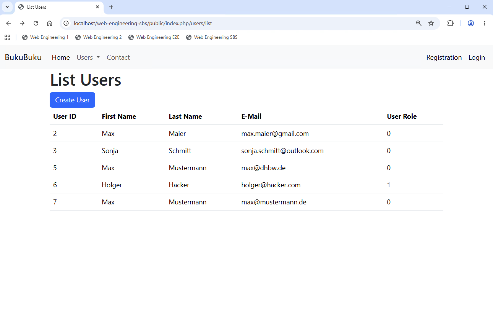
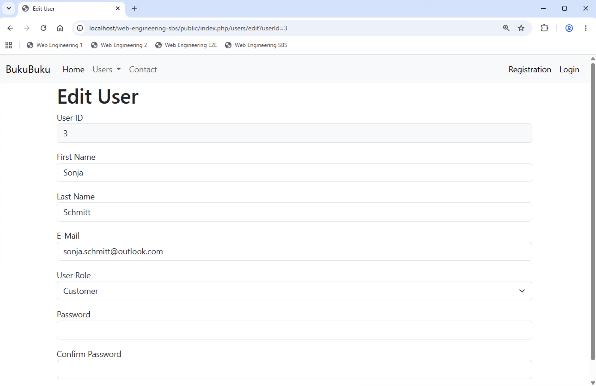
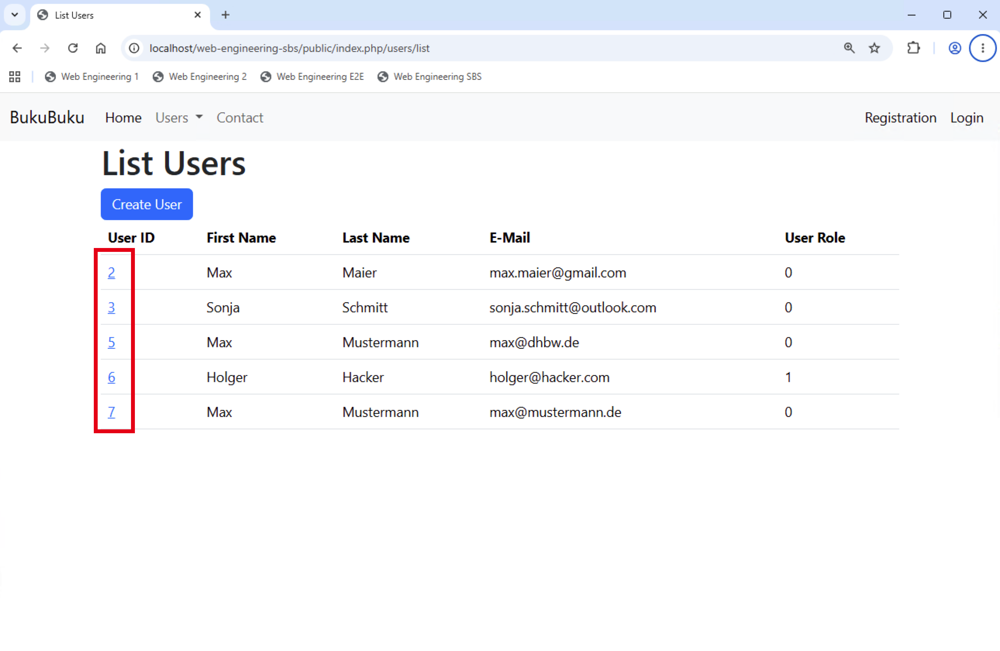

# Chapter 08: Create additional User views

In this chapter we will implement additional views to display all users and edit an existing user.

## Implement the list view (30 min)

Creating a view - respectively adjusting the already existing `list.php` file - and calling it via a new method of the `UserController` is fairly easy:

- Adjust the `list.php` file. Assume that it receives an array of all users and renders an HTML table. Ensure that the table is assigned to the HTML class `table` (this ensures a nice look of the HTML table).
- Add a button to the `list.php` file which allows to create a new user (i.e., the button shall navigate to the already existing view you have created in the previous chapter).
- Create a new `list` method in the `UserController`. Inside this method use the already existing method of the `User` model to get all users. Then pass the array of users to the view.
- Adjust the route in `index.php` to ensure that the new `list` method is called.

Your application should now show a list which looks as follows:

This view could be further improved. For example, you could display a more user friendly text to indicate if the user is an administrator. You also could implement paging to always display, for example, 10 users and allow the user to navigate back and forth through the list of users. Due to lack of time we do not implement these features.

## Implement the edit view (60 min)

Now let's create (rework) the view which is used to edit an existing user. This requires you to:

- Adapt the `edit.php` file.
- Add two additional methods to the `UserController` and implement them:
  - `public function edit(): string` (the method expects that the `userId` is passed as query parameter)
  - `public function handleEdit(): string|null`
- Finally adapt the routes in `index.php` to ensure that the new methods are used by your application.

The view should now look as follows (you have to enter the URL manually, the navigation does not yet work):

## Implement navigation from list to edit view (15 min)

Finally, you implement the navigation from the `list.php` file to the `edit.php` file. The `list.php` file shall render a hyperlink in the first column of the HTML table, which takes the users to the view to edit the corresponding user.

Also remove the entry to edit a user from the menu bar, since this does not make sense. Without the selection of the user (via the list view), the application cannot know which user to edit.
