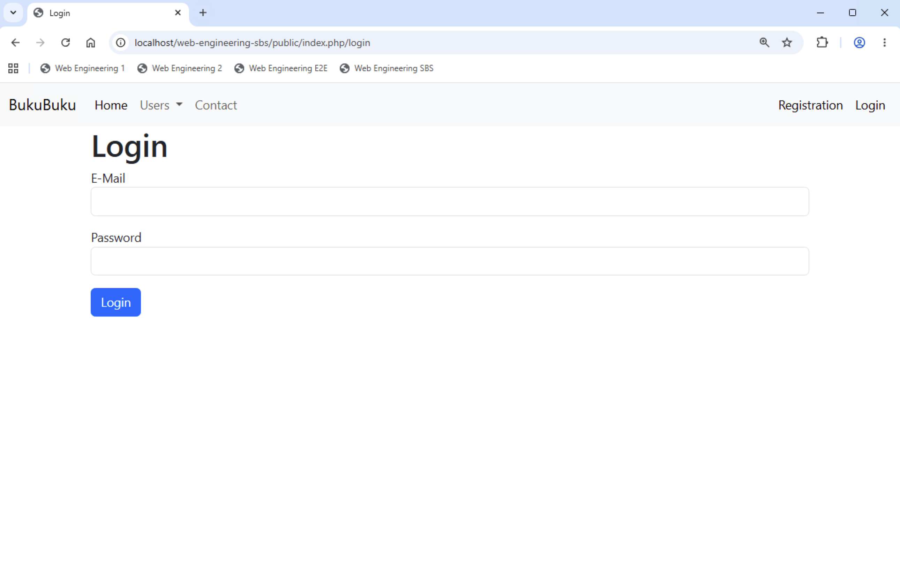
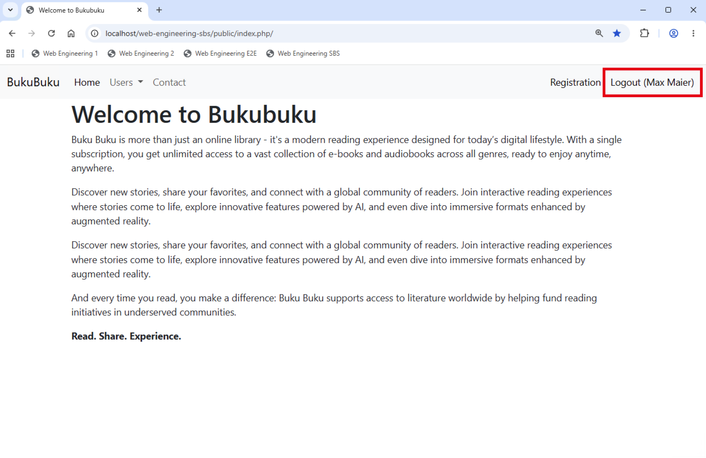

# Chapter 09: Login system

So far, there is no mechanism in place to authenticate users. In this chapter we will build a simple login system.

## Implement methods required for the login (30 min)

We use the PHP session module to store whether a user is logged in or not. Therefore create the following new methods in the `Session` class:

```
    //Login the user.
    public function login(int $userId)
    {
        $this->set('userId', $userId);
        session_regenerate_id(true);
    }

    //Logout the user.
    public function logout()
    {
        $this->unset('userId');
        session_destroy();
        session_start();
    }
```

Encapsulate them in two more new methods in the `Application` class:

```
    //Login the user.
    public function login(int $userId)
    {
        $this->session->login($userId);
    }

    //Logout the user.
    public function logout()
    {
        $this->session->logout();
    }
```

You will also need a method to determine the ID of an user from the email. And you will need a method to check that a user is allowed to login. Therefore, implement the following two methods in the `User` model:

- `static public function getUserIdByEmail(string $email): int`
- `static public function checkLogin(string $email, string $password): bool`

## Implement the login model, view and controller (75 min)

Create a new `Login` model which is a subclass of the `Model` class. It requires the following properties and methods:

- `public int $userId = 0`
- `public string $email = ''`
- `public string $password = ''`
- `static protected function getRulesets(): array`
- `static protected function propertyMapping(): array`
- `public function login(): bool`
- `public function logout(): bool`

Are you able to implement the `Login` class on your own? If not, you can take a look at how the class looks in the solution.

Next you need to rework the `login.php` file. Ensure it has two fields for email and password as well as a button to submit the form.

Add two new methods `login` and `handleLogin` to the `SiteController`. Ensure that the routes in `index.php` are properly maintained and implement the `login` method. If everything is correct, you should be able to see the login page:



Finally, implement the `handleLogin` method. If you need help, you can take a look at how the class looks in the solution.
Test the `login.php` file. You should see a success message when email and password are correct. Otherwise you should see an error message.

## Adjust the menu bar (30 min)

Let's take a look at the menu bar. At the moment it always displays an entry to login. Instead we need to implement the following behavior:

- User is not logged in: display 'Login'
- User is logged in: display the name of the user and give him a possibility to logout

First, add two more methods to the `Application` class:

```
    //Get the ID of the (logged in) user.
    public function getUserId(): int|null
    {
        return $this->session->get('userId');
    }

    //Is the user a guest?
    public function isGuest(): bool
    {
        if ($this->getUserId() == null) {
            return true;
        } else {
            return false;
        }
    }
```

Second, create an additional method in the `User` model:

```
    //Get the fullname.
    public function getFullName(): string
    {
        return $this->firstName . ' ' . $this->lastName;
    }
```

Third, create an additional method in the `Application` class:

```
    //Get the full name of the (logged in) user.
    public function getFullName(): string
    {
        if (!$this->isGuest()) {
            $user = User::fromDatabase(Application::$app->getUserId());
            return $user->getFullName() . ', ' . $this->getRole();
        } else {
            return '';
        }
    }
```

Fourth, adapt the `main.php` file to behave as described above:

- User is not logged in: display 'Login'
- User is logged in: display the name of the user and give him a possibility to logout

The menu bar should now look as follows (when the user is logged in):



## Implement logout (30 min)

Finally, add a method to the `SiteController` to log the user out. This method shall be called via GET.
Adjust the routes in `index.php`.

Wow! If you managed to follow until here, you have come a long way. There is much more work to do, of course:

- Implement models and views for books and checkouts
- Implement the required controllers
- Ensure proper transaction handling when a book is checked out (two database tables need to be updated in that case)
- Implement the form to register as a new user
- Implement a (at least basic) authorization mechanism; Only admins shall be allowed to create new books. Users must only change their own data (not the data of other users)
- ...

If you are interested in the complete implementation, you can find it at `https://github.com/ts160876/web-engineering-e2e`.
